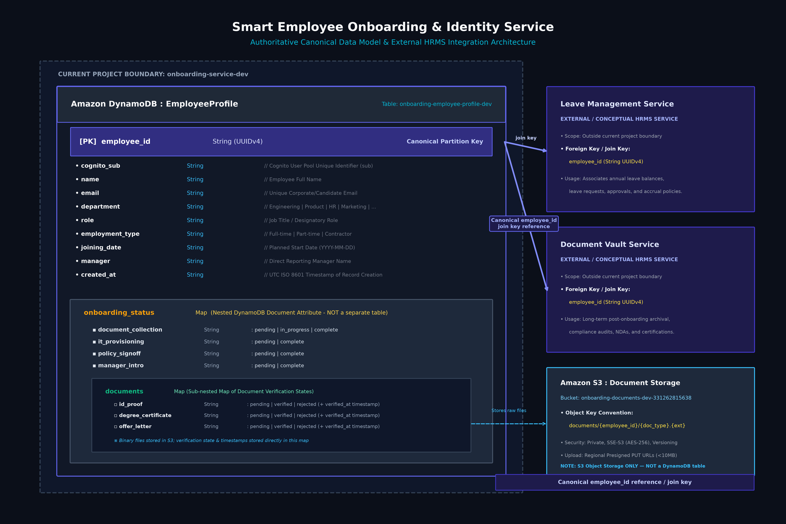

# Smart Employee Onboarding & Identity Service — Authoritative Data Model

## 1. Overview

The **Smart Employee Onboarding & Identity Service** provides the single source of truth for corporate employee identities across the wider HRMS ecosystem. The persistence model is architected on Amazon DynamoDB to deliver single-digit millisecond latency, zero-maintenance capacity scaling, and strong schema consistency through a single canonical table: **`EmployeeProfile`** (`onboarding-employee-profile-dev`).



---

## 2. Canonical Data Model: `EmployeeProfile`

### Table Specifications
- **DynamoDB Table Name**: `onboarding-employee-profile-dev`
- **Primary Key (Partition Key)**: `employee_id` (String, UUIDv4)
- **Sort Key**: None (Flat Key-Value Item Access Pattern)
- **Billing Mode**: PAY_PER_REQUEST (On-Demand Capacity)
- **Encryption**: AWS Owned Key (Server-Side Encryption)
- **Point-in-Time Recovery (PITR)**: Enabled
- **TTL**: Disabled (Permanent Canonical Employment Records)

### Item Schema & Attribute Definitions

| Attribute Name | DynamoDB Type | Description | Sample Verified Value |
|---|---|---|---|
| `employee_id` | `String` (S) | **Primary Key**: Canonical UUIDv4 generated at registration. Used as global join key across all HRMS services. | `"7037b507-00c9-4ccf-b6a9-6598b30c609e"` |
| `cognito_sub` | `String` (S) | Unique user identifier (`sub`) in the associated Amazon Cognito User Pool. | `"b1c39daa-c0d1-700b-314e-beb2f899a4bf"` |
| `name` | `String` (S) | Legal full name of the employee. | `"Test Employee"` |
| `email` | `String` (S) | Corporate or personal email address (unique in Cognito). | `"employee-test@example.com"` |
| `department` | `String` (S) | Organizational business unit or department. | `"Engineering"` |
| `role` | `String` (S) | Official designation or job title. | `"Software Engineer"` |
| `employment_type` | `String` (S) | Engagement classification (`Full-time`, `Part-time`, `Contractor`). | `"Full-time"` |
| `joining_date` | `String` (S) | Scheduled start date in ISO format (`YYYY-MM-DD`). | `"2026-09-15"` |
| `manager` | `String` (S) | Full name of the designated reporting manager. | `"Test Manager"` |
| `created_at` | `String` (S) | ISO 8601 UTC timestamp of record creation. | `"2026-09-13T15:15:11.895753+00:00"` |
| `onboarding_status` | `Map` (M) | **Nested DynamoDB Map**: Tracks multi-stage workflow milestones and document verification states. **NOT a separate table**. | *(See Nested Map Breakdown below)* |

---

## 3. Nested Structure: `onboarding_status` Map

Rather than normalizing workflow state across disparate relational or NoSQL tables, this architecture leverages DynamoDB native Document Maps (`M`). All stage lifecycles and document verification metadata are nested directly within the single `EmployeeProfile` item.

### Stage Attributes within `onboarding_status`

| Stage Key | Type | Allowed Values | Description |
|---|---|---|---|
| `document_collection` | `String` | `pending`, `in_progress`, `complete` | Status of mandatory document ingestion. Accompanied by timestamps `document_collection_started_at` and `document_collection_completed_at`. |
| `it_provisioning` | `String` | `pending`, `complete` | Status of corporate account and asset allocation. Accompanied by `it_provisioning_completed_at`. |
| `policy_signoff` | `String` | `pending`, `complete` | Status of corporate compliance and policy handbook acknowledgment. Accompanied by `policy_signoff_completed_at`. |
| `manager_intro` | `String` | `pending`, `complete` | Status of introductory manager scheduling. Accompanied by `manager_intro_completed_at`. |
| `documents` | `Map` | *(Sub-nested Map)* | Sub-map tracking individual document verification states. |

### Sub-Nested Document Verification States (`documents`)

Under `onboarding_status.documents`, three required document types are tracked:

```json
"documents": {
  "id_proof": "verified",
  "id_proof_verified_at": "2026-09-13T15:35:57.226139+00:00",
  "degree_certificate": "verified",
  "degree_certificate_verified_at": "2026-09-13T15:37:35.648208+00:00",
  "offer_letter": "verified",
  "offer_letter_verified_at": "2026-09-13T15:38:11.346691+00:00"
}
```

- Each document is evaluated independently as `pending`, `verified`, or `rejected`.
- If an uploaded file fails validation (e.g. invalid file format or size $>10\text{ MB}$), the S3 object is purged, and a rejection reason is recorded in DynamoDB (e.g. `offer_letter_rejection_reason`).
- When all three items reach `verified`, `document_collection` transitions to `complete`.

---

## 4. Storage Architecture: S3 Object Storage vs. DynamoDB

A strict boundary exists between structured transactional metadata and unstructured binary storage:

- **DynamoDB (`EmployeeProfile`)**: Stores only metadata, stage transitions, verification statuses, and timestamps. No binary payloads or base64 streams are stored in DynamoDB.
- **Amazon S3 (`onboarding-documents-dev-331262815638`)**: Stores raw binary files (`.pdf`, `.jpg`, `.png`).
  - **S3 Key Convention**: `documents/{employee_id}/{document_type}.{extension}`
  - **Security**: Private bucket enforcing SSE-S3 (`AES256`), Versioning, and `BlockPublicAcls`.
  - **Direct Upload**: Browser uploads binary files directly to S3 using time-limited regional presigned PUT URLs, completely bypassing the API Gateway payload limit (10MB) and Lambda compute bottlenecks.

---

## 5. Canonical Identity & Conceptual External HRMS Integrations

The `EmployeeProfile` table is the **canonical root** of an employee's organizational lifecycle. In a full microservices HRMS architecture, other decoupled services reference `EmployeeProfile.employee_id` as their global foreign key / join key:

```mermaid
classDiagram
    class EmployeeProfile {
        <<DynamoDB Canonical Table>>
        +String employee_id [PK]
        +String cognito_sub
        +String name
        +String email
        +String department
        +String role
        +String employment_type
        +String joining_date
        +String manager
        +String created_at
        +Map onboarding_status
    }

    class LeaveManagementService {
        <<External HRMS Microservice>>
        +String employee_id [FK]
        +Float leave_balance
        +List leave_requests
    }

    class DocumentVaultService {
        <<External HRMS Microservice>>
        +String employee_id [FK]
        +List archived_documents
        +List compliance_records
    }

    class S3DocumentsStorage {
        <<Private S3 Object Storage>>
        +Object documents/{employee_id}/*
    }

    EmployeeProfile "1" --> "*" LeaveManagementService : Canonical employee_id reference / join key
    EmployeeProfile "1" --> "*" DocumentVaultService : Canonical employee_id reference / join key
    EmployeeProfile ..> S3DocumentsStorage : References file paths via doc type
```

### Distinction Between Implemented vs. Conceptual Services

| Component | Architecture Role | Implementation Status | Data Relationship |
|---|---|---|---|
| **`EmployeeProfile`** | Canonical Core Identity | **Implemented (Live)** | Single canonical table in DynamoDB (`onboarding-employee-profile-dev`). Primary key `employee_id`. |
| **`onboarding-documents`** | Object Storage Bucket | **Implemented (Live)** | S3 bucket storing binary files under `documents/{employee_id}/...`. |
| **`Leave Management`** | External Microservice | **Conceptual / External** | Outside current project boundary. References `employee_id` to link leave allocations, balance adjustments, and approvals. |
| **`Document Vault`** | External Microservice | **Conceptual / External** | Outside current project boundary. References `employee_id` to index enterprise contracts, tax forms, and post-onboarding certifications. |

> **Note on Scope**: The current Smart Employee Onboarding & Identity Service defines and owns **only** `EmployeeProfile` and the S3 documents bucket. No separate tables for `Document`, `AuditLog`, or `OnboardingTask` exist; all state is encapsulated in the canonical `EmployeeProfile` item.
