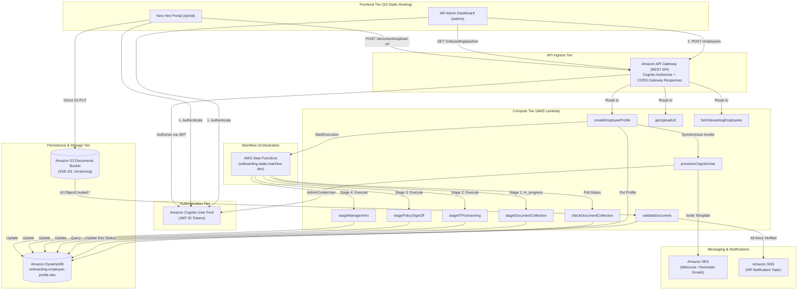
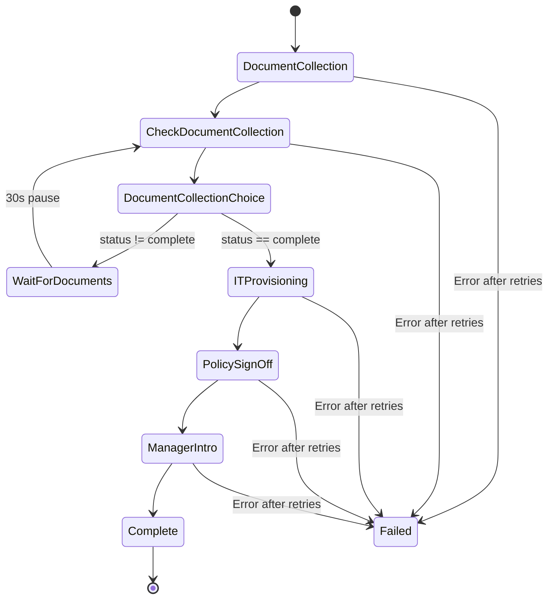
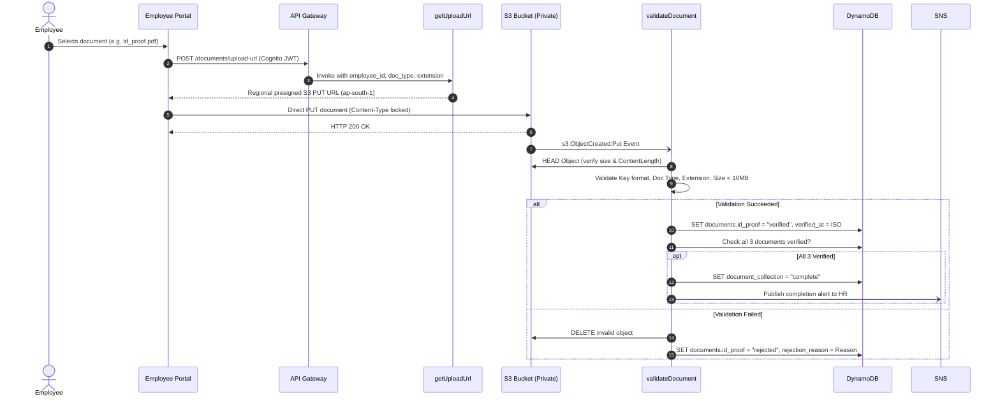

# Smart Employee Onboarding & Identity Service — Working Onboarding Flow

## 1. Overview

The **Smart Employee Onboarding & Identity Service** is an automated, event-driven enterprise onboarding platform built on AWS serverless technologies. It coordinates the end-to-end lifecycle of new-hire onboarding—from HR registration and credential issuance through document collection, automated validation, IT provisioning, policy sign-off, and introductory communications—establishing the canonical employee identity record used across peripheral HRMS microservices.

### Architecture & Request Flow



---

## 2. End-to-End Onboarding Flow

The end-to-end onboarding lifecycle proceeds through 16 orchestrated steps:

1. **HR Registration**: An HR administrator authenticates via Cognito and submits new-hire details (name, email, role, department, manager, joining date, employment type) via the HR Admin Dashboard.
2. **DynamoDB Profile Initialization**: `POST /employees` invokes `createEmployeeProfile`, which generates a UUIDv4 `employee_id`, writes the canonical record to DynamoDB (`onboarding-employee-profile-dev`) with initial status attributes set to `pending`.
3. **Cognito User Provisioning**: `createEmployeeProfile` invokes `provisionCognitoUser`, which calls Cognito `AdminCreateUser` with `custom:employee_id`, `custom:role`, and `custom:department` custom attributes.
4. **Welcome Email Dispatched**: Cognito generates a temporary password and dispatches an automated invitation/welcome email to the new hire.
5. **Step Functions Workflow Triggered**: `createEmployeeProfile` starts execution of `onboarding-state-machine-dev` passing `{ "employee_id": "<uuid>" }`.
6. **Document Collection Initialized**: The state machine executes task `DocumentCollection` (`stageDocumentCollection`), updating `onboarding_status.document_collection` to `in_progress` with `document_collection_started_at`.
7. **Document Polling Loop**: The state machine transitions to `CheckDocumentCollection` (`checkDocumentCollection`), which inspects the employee's DynamoDB record for document verification status.
8. **Asynchronous Polling Pause**: While required documents are incomplete, the state machine branches to `WaitForDocuments` (30-second delay) and re-evaluates `CheckDocumentCollection`.
9. **Employee Uploads Documents**: The employee logs into the Employee Portal, obtains presigned S3 PUT URLs via `POST /documents/upload-url`, and uploads three mandatory files directly to S3:
   - ID Proof (`id_proof.pdf` / `.jpg` / `.png`)
   - Degree Certificate (`degree_certificate.pdf` / `.jpg` / `.png`)
   - Signed Offer Letter (`offer_letter.pdf` / `.jpg` / `.png`)
10. **S3 Event Trigger**: Each successful S3 upload emits an `s3:ObjectCreated:*` notification that invokes `validateDocument`.
11. **Document Validation**: `validateDocument` validates key structure (`documents/{employee_id}/{type}.{ext}`), checks file extension against allowed formats, inspects S3 object size (< 10 MB), and records `verified` status with ISO timestamps in DynamoDB.
12. **Document Collection Completed**: Upon verifying the third document, `validateDocument` marks `onboarding_status.document_collection` as `complete` with timestamp `document_collection_completed_at`, and publishes an alert to `OnboardingNotificationsTopic`.
13. **Step Functions Resumes Progression**: On the subsequent polling cycle, `CheckDocumentCollection` detects `document_collection: complete`. The Choice rule transitions execution to the remaining linear stages:
    $$\text{DocumentCollection} \longrightarrow \text{ITProvisioning} \longrightarrow \text{PolicySignOff} \longrightarrow \text{ManagerIntro} \longrightarrow \text{Complete}$$
14. **Full Stage Completion**: Each subsequent stage Lambda executes and records completion timestamps in DynamoDB:
    - `it_provisioning` $\rightarrow$ `complete`
    - `policy_signoff` $\rightarrow$ `complete`
    - `manager_intro` $\rightarrow$ `complete`
15. **HR Visibility**: HR administrators monitor live candidate progression through the **Pipeline Directory** tab (`GET /onboarding/pipeline`), reflecting live DynamoDB state with search and department filtering.
16. **Portal Access**: The employee accesses the **Employee Portal**, viewing verified badges across all four lifecycle milestones.

---

## 3. Step Functions Workflow Explanation

The orchestration engine is defined in `backend/statemachines/onboarding-state-machine.asl.json` and deployed as `onboarding-state-machine-dev`.

### ASL State Diagram



### State Specifications

| State Name | Type | Handler / Resource | Description |
|---|---|---|---|
| `DocumentCollection` | `Task` | `stageDocumentCollection` | Sets `document_collection` to `in_progress` in DynamoDB. |
| `CheckDocumentCollection` | `Task` | `checkDocumentCollection` | Queries DynamoDB `onboarding_status.document_collection`. Injects result into `$.check_result`. |
| `DocumentCollectionChoice` | `Choice` | Native ASL | Evaluates `$.check_result.document_collection == "complete"`. Routes to `ITProvisioning` or defaults to `WaitForDocuments`. |
| `WaitForDocuments` | `Wait` | Native ASL (30s) | Non-blocking pause allowing employee to complete document uploads. Loops back to `CheckDocumentCollection`. |
| `ITProvisioning` | `Task` | `stageITProvisioning` | Simulates IAM/laptop provisioning; sets `it_provisioning` to `complete`. |
| `PolicySignOff` | `Task` | `stagePolicySignOff` | Simulates security handbook sign-off; sets `policy_signoff` to `complete`. |
| `ManagerIntro` | `Task` | `stageManagerIntro` | Simulates introductory meeting schedule; sets `manager_intro` to `complete`. |
| `Complete` | `Succeed` | Native ASL | Successful workflow termination state. |
| `Failed` | `Fail` | Native ASL | Workflow error terminal state. |

### Retry & Catch Policies
All task states implement exponential backoff:
- `IntervalSeconds`: 2
- `MaxAttempts`: 3
- `BackoffRate`: 2.0
- `Catch`: Catches `States.ALL`, stores error info in `$.error`, and transitions to `Failed`.

---

## 4. Document Validation Flow

Document ingestion enforces a zero-trust model where file uploads are isolated to S3 presigned URLs, and S3 events trigger automated verification.



### Validation Constraints
- **Allowed Document Types**: `id_proof`, `degree_certificate`, `offer_letter`
- **Allowed Extensions**: `pdf`, `jpg`, `png`
- **Maximum File Size**: Strictly $< 10\text{ MB}$ ($10{,}485{,}759\text{ bytes}$)
- **S3 Key Convention**: `documents/{employee_id}/{document_type}.{extension}`
- **Security Action on Invalid Files**: Objects exceeding size limits, having illegal extensions, or referencing non-existent employee profiles are immediately purged from S3, and the rejection reason is recorded in DynamoDB.

---

## 5. Final Verification Results (Phase 5 Live Execution)

End-to-end integration was validated against live AWS resources in `ap-south-1` using employee record `7037b507-00c9-4ccf-b6a9-6598b30c609e`.

### Live Evidence Record

```json
{
  "employee_id": "7037b507-00c9-4ccf-b6a9-6598b30c609e",
  "name": "Test Employee",
  "email": "employee-test@example.com",
  "department": "Engineering",
  "role": "Software Engineer",
  "manager": "Test Manager",
  "joining_date": "2026-09-15",
  "employment_type": "Full-time",
  "cognito_sub": "b1c39daa-c0d1-700b-314e-beb2f899a4bf",
  "created_at": "2026-09-13T15:15:11.895753+00:00",
  "onboarding_status": {
    "document_collection": "complete",
    "document_collection_started_at": "2026-09-13T15:15:12.854615+00:00",
    "document_collection_completed_at": "2026-09-13T15:38:11.346691+00:00",
    "documents": {
      "id_proof": "verified",
      "id_proof_verified_at": "2026-09-13T15:35:57.226139+00:00",
      "degree_certificate": "verified",
      "degree_certificate_verified_at": "2026-09-13T15:37:35.648208+00:00",
      "offer_letter": "verified",
      "offer_letter_verified_at": "2026-09-13T15:38:11.346691+00:00"
    },
    "it_provisioning": "complete",
    "it_provisioning_completed_at": "2026-09-13T15:38:21.561119+00:00",
    "policy_signoff": "complete",
    "policy_signoff_completed_at": "2026-09-13T15:38:22.420734+00:00",
    "manager_intro": "complete",
    "manager_intro_completed_at": "2026-09-13T15:38:23.160932+00:00"
  }
}
```

### Stage Summary

| Stage | Expected Status | Verified Status | Verification Timestamp |
|---|---|---|---|
| **Document Collection** | `complete` | **COMPLETE** | `2026-09-13T15:38:11Z` |
| **IT Provisioning** | `complete` | **COMPLETE** | `2026-09-13T15:38:21Z` |
| **Policy Sign-Off** | `complete` | **COMPLETE** | `2026-09-13T15:38:22Z` |
| **Manager Intro** | `complete` | **COMPLETE** | `2026-09-13T15:38:23Z` |

### Step Functions Execution Details
- **Execution Name**: `bb791e48-a436-4ada-bd4c-3d2d7e3303fc`
- **Execution Status**: `SUCCEEDED`
- **Start Time**: `2026-09-13T15:15:12Z` (`20:45:12 IST`)
- **Stop Time**: `2026-09-13T15:38:23Z` (`21:08:23 IST`)
- **Total Duration**: Approximately **23 minutes** (reflecting real employee document review and upload interval during which `WaitForDocuments` maintained state loop)
- **Pipeline Directory**: The deployed HR Admin Dashboard loads candidate `7037b507-00c9-4ccf-b6a9-6598b30c609e` displaying all 4 stages marked **COMPLETE**.

---

## 6. Evidence Screenshot Index

The following screenshots capture the verified state of the deployed AWS infrastructure and applications:

| # | Artifact Filename | Subject / AWS Resource | What It Proves |
|---|---|---|---|
| **01** | `01_DynamoDB_EmployeeProfile_Table.png` | DynamoDB `onboarding-employee-profile-dev` | EmployeeProfile canonical record table view showing primary key `employee_id`. |
| **02** | `02_DynamoDB_Onboarding_Status_Complete.png` | DynamoDB `onboarding-employee-profile-dev` | Item view showing `onboarding_status` with all 4 workflow stages marked `complete`. |
| **03** | `03_DynamoDB_All_Documents_Verified.png` | DynamoDB `onboarding-employee-profile-dev` | Item view showing `documents` map with `id_proof`, `degree_certificate`, and `offer_letter` all `verified`. |
| **04** | `04_StepFunctions_Graph_View.png` | AWS Step Functions Console | State machine visual graph view showing workflow execution path through all stages. |
| **05** | `05_StepFunctions_Event_History_Polling.png` | AWS Step Functions Console | Execution event history detailing the `DocumentCollection` polling loop and `WaitForDocuments` state. |
| **06** | `06_StepFunctions_Succeeded.png` | AWS Step Functions Console | State machine execution summary confirming overall status reached `SUCCEEDED`. |
| **07** | `07_HR_Pipeline_Directory.png` | Deployed Frontend UI (`/admin`) | HR Admin Dashboard Pipeline Directory displaying live employee candidate with all four stages marked **COMPLETE**. |

---

## 7. Security and Authentication Notes

1. **Cognito User Pool Authorization**:
   - API Gateway uses a `COGNITO_USER_POOLS` authorizer (`CognitoAuthorizer`) configured with `method.request.header.Authorization`.
   - The frontend transmits the raw Cognito ID token in the `Authorization` header.
2. **CORS Hardening on Error Responses**:
   - API Gateway is configured with explicit `GatewayResponses` for `UNAUTHORIZED` (401) and `DEFAULT_4XX` to include `Access-Control-Allow-Origin: *` and `Access-Control-Allow-Headers`. This prevents browser CORS blocking on failed auth requests and surfaces proper authentication challenges.
3. **S3 Private Document Storage**:
   - Documents bucket (`onboarding-documents-dev-331262815638`) enforces `BlockPublicAcls`, `BlockPublicPolicy`, `IgnorePublicAcls`, and `RestrictPublicBuckets`.
   - All uploads and reads occur via scoped, regional S3 presigned URLs generated server-side.
   - Server-Side Encryption (`AES256`) and bucket versioning are strictly enabled.
4. **Least-Privilege Execution Roles**:
   - Every Lambda function runs under an isolated IAM execution role scoped exclusively to its designated DynamoDB keys, S3 object prefixes, or Step Functions execution ARNs.

---

## 8. Known Limitations

1. **SES Sandbox Mode**: In `ap-south-1`, Amazon SES operates in sandbox mode unless production access is requested. Outbound welcome emails and reminder notifications can only be delivered to verified recipient identities.
2. **Polling Interval Cadence**: The Step Functions state machine employs a fixed 30-second polling wait (`WaitForDocuments`). A high volume of concurrent onboardings will generate periodic `checkDocumentCollection` DynamoDB reads until upload completion.
3. **Single Regional S3 Endpoint**: Presigned PUT URLs are bound strictly to `s3.ap-south-1.amazonaws.com`. Cross-region DNS propagation redirects (HTTP 307) are mitigated by enforcing regional client configurations.
